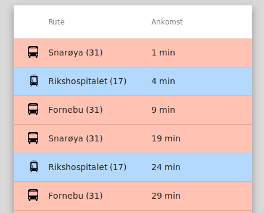

# RuterFrame

A mad dash little angular application which shows the bus routes near me.

Why?

...Trying out angular I guess...

## Development server

Run `ng serve` for a dev server. Navigate to `http://localhost:4200/`. The app will automatically reload if you change any of the source files.

## Build

Run `ng build` to build the project. The build artifacts will be stored in the `dist/` directory. Use the `--prod` flag for a production build.
